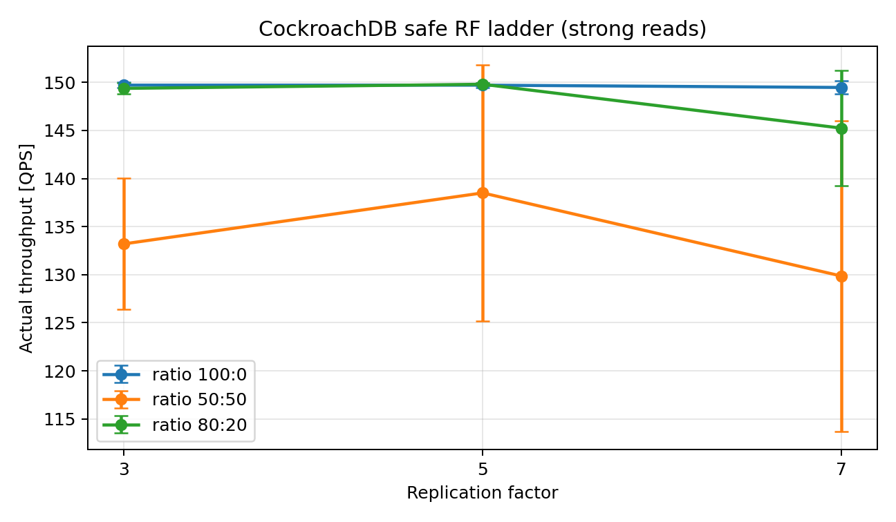
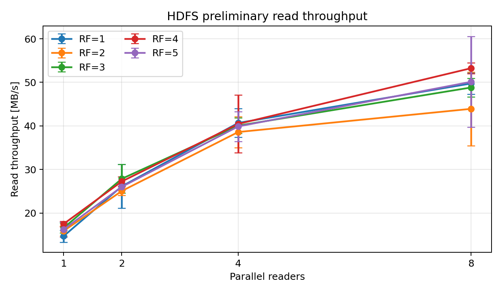

# When More Replicas Do Not Help: Testing File-Storage Replication Intuition in Distributed SQL

## Abstract

Replication-factor adaptation is well motivated in distributed file storage, where an additional block copy may improve locality, distribute concurrent reads, or protect another failure domain. This paper investigates whether the same tuning intuition transfers to a consensus-based distributed SQL database. CockroachDB is the primary object of study; HDFS is used as an architectural and experimental contrast that exposes why replication can act as a read-scaling mechanism in file storage. In CockroachDB, replicas participate in Raft groups, transactions, and leaseholder-directed execution, so an additional voting replica does not automatically create an independent path for strongly consistent reads. Rather than proposing a new adaptation algorithm, we first test whether RF is an effective and predictable database control action. Preliminary local results show no clear monotonic CockroachDB throughput benefit under strong read-only or mixed workloads. The HDFS contrast shows a different read-serving mechanism, although reader parallelism dominates RF in the current single-host evidence. The resulting argument is database-centered: RF adaptation is worthwhile only when a concrete database mechanism, such as failure-domain coverage, leaseholder placement, follower reads, or geographic locality, can repay its storage, coordination, and reconfiguration costs.

Keywords: replication factor, distributed SQL, CockroachDB, HDFS, consensus, distributed storage, performance evaluation

## 1. Introduction: A File-Storage Idea Applied to Databases

Replication level and replica placement are established control mechanisms in distributed file systems. GFS stores chunks across commodity machines to provide fault tolerance and high aggregate performance [1]. HDFS exposes a configurable per-file replication factor and uses rack-aware placement and nearest-replica selection to balance reliability, write traffic, and read locality [2]. Later systems made replication more explicitly workload-aware. Scarlett creates additional replicas for popular content in MapReduce clusters [3], while Copyset Replication demonstrates that the placement pattern of a fixed number of replicas can materially change durability and recovery behavior [4]. This body of work creates a plausible tuning intuition: if demand becomes read-heavy or geographically skewed, create more replicas near that demand.

This paper asks whether that intuition transfers to a distributed SQL database. In a file system, another block replica can become another physical read source. In a database such as CockroachDB, another voting replica joins a consistency and transaction protocol. Raft orders replicated state-machine updates through a leader and commits log entries after quorum agreement [5]. CockroachDB applies this model to replicated key ranges and combines it with leaseholders and distributed transaction processing [6]. Increasing RF therefore changes fault tolerance, replication fan-out, quorum topology, and placement choices, but it does not automatically create another independent path for strongly consistent reads.

CockroachDB is therefore the research target, while HDFS provides the contrast. The HDFS experiment is not intended as a comprehensive product comparison. It illustrates the architectural mechanism from which the RF tuning intuition originates and provides a reference against which the CockroachDB behavior can be interpreted. Instead of proposing another adaptive replication policy, the paper first asks whether changing RF is a useful database action at all.

The contribution of this short paper is threefold:

1. It evaluates RF as a performance-control action in consensus-based distributed SQL.
2. It uses file storage to explain why RF can improve reads in one architecture but not automatically in a database.
3. It provides a reproducible experimental scaffold and identifies the database conditions that would justify future RF adaptation.

## 2. Why File-Storage Intuition May Fail in Distributed SQL

### 2.1 File Storage as the Source of the Intuition

HDFS separates metadata coordination from the data path. The NameNode manages the file-system namespace, block locations, replication decisions, and placement policy. DataNodes store blocks and serve client reads and writes. After obtaining block locations from the NameNode, a client transfers data directly to or from DataNodes. This architecture is often described historically as master/slave, although metadata-master and data-serving worker roles are more precise terms and modern HDFS deployments can add NameNode high availability.

The RF is configurable per file and can be changed after creation [2]. An additional replica can improve resilience, place data in another rack or data center, give a reader a closer source, or distribute concurrent reads across more storage nodes. None of these benefits is automatic. They depend on placement, topology, scheduling, caching, and sufficient concurrent demand. The costs are also direct: additional storage, replication traffic, longer or more expensive write pipelines, and background work when RF is changed.

### 2.2 The CockroachDB Execution Path

CockroachDB partitions data into ranges, each represented by a Raft replication group [6]. The Raft leader orders log entries for the group. A range leaseholder coordinates most strongly consistent reads and proposes writes, although the Raft leader and leaseholder need not be conceptually identical. A write is not simply copied to passive storage nodes; it becomes a replicated state-machine operation that must reach a quorum before commitment.

Increasing the number of voting replicas changes the number and distribution of failure domains the range can tolerate. It also changes replication fan-out and, at some RF transitions, the majority size required for commitment. For strong reads, additional replicas do not behave like arbitrary nearest HDFS block sources because requests are normally constrained by leaseholder and transaction semantics. CockroachDB follower reads can use non-leaseholder replicas, including geographically closer replicas, but they use a bounded-staleness model and should therefore be evaluated as a separate consistency/performance mode.

### 2.3 Consequences for Database RF Tuning

| Tuning question | File-storage intuition | Distributed SQL implication |
|---|---|---|
| Can another replica serve reads? | Normally yes, subject to placement | Not for arbitrary strong reads |
| What does RF primarily change? | Number and location of block copies | Consensus group, fault tolerance, placement, and replication fan-out |
| Where can performance improve? | Locality and parallel read service | Leaseholder placement or eligible follower reads |
| Main incremental risk | Storage, writes, and re-replication | Coordination, quorum, rebalancing, and write cost |

The contrast does not imply that file systems always benefit monotonically from RF. It identifies why a benefit is architecturally possible there and why it must be demonstrated separately in a database. The central database question is whether CockroachDB exposes any workload regime in which the additional consensus replica becomes useful enough to outweigh its cost.

## 3. Study Scope and Research Questions

The study intentionally stops before algorithm design. An adaptive controller is useful only if changing RF produces a repeatable benefit, the workload remains in the beneficial regime long enough to amortize reconfiguration, and the controller can observe the mechanism that causes the benefit. The paper therefore evaluates RF as a candidate action rather than proposing when or how a controller should trigger it.

This paper is organized around three research questions:

RQ1. Does increasing RF improve CockroachDB throughput or latency under strong read-only and mixed read/write workloads?

RQ2. Do the CockroachDB results exhibit the read-scaling behavior that motivates RF adaptation in file storage?

RQ3. Under which consistency, placement, workload-duration, and geographic conditions could RF adaptation still be worthwhile in distributed SQL?

## 4. Experimental Methodology

### 4.1 Primary Database Experiment

The CockroachDB experiment uses a local Docker Compose cluster with nine CockroachDB nodes. A benchmark table is recreated before each run. The replication factor is varied, and workloads are generated with configurable read/write ratios. For each run, the experiment records target and actual throughput, read and write success counts, error counts, SQL-level latency metrics, KV execution latency metrics, and process memory metrics where available.

The current safe local ladder uses replication factors 3, 5, and 7; read/write ratios 100:0, 80:20, and 50:50; three repetitions; randomized run order; 90 seconds of workload duration; 30 seconds of cooldown; and a target of 150 QPS. The full 27-run matrix completed with zero connect, read, write, and metrics errors, passed validation, and left all nine CockroachDB containers running.

These settings provide stronger preliminary evidence than the earlier two-repetition seed, but they remain below the paper-grade design target of at least 180 seconds per run. The 150 QPS cap also means that read-only and most 80:20 observations measure successful target attainment rather than maximum throughput. Higher RF values should be included only in an environment that can sustain them without destabilizing the cluster; the failed local RF=9 attempt is diagnostic evidence about an environment limit and is not included in performance curves.

### 4.2 File-Storage Contrast

The HDFS experiment is a contrast rather than an equal product benchmark. It uses a local Docker Compose setup with one NameNode, five DataNodes, and one client container. For each replication factor, the benchmark writes a dataset to HDFS, waits for the requested replication factor to be applied, and then measures read throughput with different numbers of parallel readers.

The current HDFS seed sweep uses replication factors 1 through 5, four 64 MB files, reader counts 1, 2, 4, and 8, two repetitions, and randomized run order. This is still smaller than the intended paper-grade experiment, but it is substantially more informative than the initial smoke test because it covers the full local HDFS RF range and multiple parallel-read levels.

Larger HDFS runs should extend this design to larger files, more files, higher reader counts where stable, and at least three repetitions. Their role is to test the file-storage mechanism sufficiently to support the architectural contrast, not to establish a general performance ranking between HDFS and CockroachDB.

### 4.3 Reproducibility and Validation

The repository includes scripts for running sweeps, collecting metrics, validating result directories, and generating grouped summaries. Each main sweep writes metadata describing the command line, platform, Python version, working directory, selected environment variables, and experiment parameters. Generated raw result directories are ignored by Git, while small curated preliminary CSV files are tracked under `paper/data/preliminary/`.

## 5. Preliminary Database Results and File-Storage Contrast

### 5.1 CockroachDB: The Primary Result

The safe CockroachDB ladder completed 27 out of 27 planned runs with zero connect, read, write, and metrics errors. Table 1 summarizes actual throughput across three repetitions.

Table 1. Preliminary CockroachDB actual QPS, mean (standard deviation).

| Ratio | RF=3 | RF=5 | RF=7 |
|---|---:|---:|---:|
| 100:0 | 149.71 (0.30) | 149.71 (0.27) | 149.47 (0.67) |
| 80:20 | 149.37 (0.57) | 149.80 (0.16) | 145.24 (6.00) |
| 50:50 | 133.20 (6.84) | 138.50 (13.33) | 129.86 (16.14) |

The read-only workload reaches the 150 QPS target at every RF with very little variation. This is evidence that all three configurations sustain the selected load, but it cannot establish equal maximum capacity or a read-scaling benefit because the workload generator caps the observation. RF=3 and RF=5 similarly reach the target in the 80:20 workload, while RF=7 averages 145.24 QPS and exhibits greater variation.

The 50:50 workload exposes a clearer saturation regime. Mean throughput is non-monotonic and variability is substantial: RF=5 has the highest mean, but its standard deviation is nearly twice that of RF=3, and RF=7 has both the lowest mean and the largest spread. No RF provides a stable monotonic improvement. The result is consistent with the architectural expectation that additional voting replicas do not act as independent strong-read servers and may interact with consensus work, leaseholder placement, range reconfiguration, and shared-host contention.

The safe ladder therefore strengthens the negative result without identifying a universally optimal RF. It supports the claim that RF alone is not a predictable strong-read scaling control in this setup. A follow-up load sweep is still needed to estimate capacity boundaries at each RF rather than comparing configurations under a single capped target.

### 5.2 HDFS: Interpreting the Contrast

The HDFS seed sweep completed 40 out of 40 planned measurements and passed validation. It used RF=1..5, two repetitions, four 64 MB files, and reader counts 1, 2, 4, and 8. Table 2 summarizes read throughput.

Table 2. Preliminary HDFS read throughput summary in MB/s.

| RF | 1 reader | 2 readers | 4 readers | 8 readers |
|---:|---:|---:|---:|---:|
| 1 | 14.67 | 26.13 | 40.69 | 49.73 |
| 2 | 15.87 | 25.05 | 38.59 | 43.92 |
| 3 | 16.56 | 27.86 | 40.06 | 48.82 |
| 4 | 17.48 | 27.24 | 40.46 | 53.24 |
| 5 | 16.21 | 26.01 | 39.87 | 50.12 |

The clearest HDFS pattern is not monotonic improvement with RF, but scaling with the number of parallel readers. Moving from one reader to eight readers increases read throughput by roughly three times across all RF settings. The RF effect is smaller and non-monotonic in the local Docker setup: RF=4 is best for one and eight readers, while RF=3 is best for two readers and RF=1 is close to the best case for four readers.

This result does not establish that increasing RF always improves HDFS performance. Its role in the paper is narrower. HDFS has a direct architectural path by which another block copy can serve a nearby or concurrent reader, even though the current shared-host experiment does not isolate that benefit cleanly. CockroachDB strong reads lack the corresponding generic path. The contrast therefore helps explain why the absence of monotonic database improvement is plausible rather than surprising.

## 6. Implications for RF Tuning in Distributed SQL

The primary database result does not support a rule such as "increase RF for read-heavy workloads." The file-storage analogy is insufficient because CockroachDB does not normally turn every additional voting replica into an independent strong-read server. RF is a useful database action only when it activates a concrete CockroachDB mechanism whose value exceeds the cost of creating and maintaining the replica.

### 6.1 Resilience Is the Default Database Benefit

The clearest reason to increase CockroachDB RF is not read scaling but a required failure-tolerance level. Additional replicas can protect against more node failures or allow placement across racks, availability zones, or regions. However, replica count alone is insufficient: Copysets illustrates that the correlation structure of placement can matter as much as the nominal number of copies [4]. The database decision should therefore be expressed as a failure-domain and placement requirement, not merely as a larger integer.

### 6.2 Database Read Benefits Require an Eligible Path

The file-storage contrast shows the missing mechanism: in HDFS, the client can select a nearby block replica and concurrent readers may distribute work over DataNodes. CockroachDB can obtain an analogous locality benefit only when reads are eligible to use the additional database replica. This may occur through deliberate leaseholder placement or through follower reads with acceptable staleness. Without one of those paths, increasing RF for a read-heavy strong-consistency workload has no clear reason to increase read-serving capacity.

### 6.3 Geography Can Make the Database Case Stronger

Geography can make RF valuable when database placement converts remote access into local access. Geographically distributed replicas primarily provide survivability and placement options, while strong writes still need a quorum. Spreading voters across distant regions can therefore put WAN latency on the commit path. Systems such as Spanner demonstrate the value of explicit geographic placement and consistency-aware replication [7], but also show that global replication is a topology and protocol decision rather than a free consequence of increasing RF.

For CockroachDB, a geographically close replica becomes a performance asset only if the leaseholder is placed appropriately or the application can use follower reads with acceptable staleness. Otherwise, another remote voting replica may improve resilience without improving foreground read latency. The paper should therefore distinguish three cases: strong leaseholder reads, bounded-staleness follower reads, and writes requiring a geographically distributed quorum.

### 6.4 Database Reconfiguration Must Be Amortized

Dynamic CockroachDB RF changes create replicas, move range data, and trigger rebalancing. The beneficial workload regime must last long enough to amortize that work. A policy reacting to a short burst may finish reconfiguration only after the burst has disappeared. RF changes can also overlap with lease transfers, range movement, compaction, and background maintenance.

### 6.5 Conditions Where Database RF Is Unlikely to Help

An RF increase is unlikely to improve performance when:

1. strong reads remain concentrated at one leaseholder;
2. the workload is write-heavy and additional replicas mainly add replication work;
3. all logical replicas share the same physical disk, host scheduler, or network bottleneck;
4. the workload spike is shorter than replica creation and rebalancing;
5. placement and read mode do not make the new replica useful to readers; or
6. achieved throughput is already limited by the client or workload generator.

These conditions explain why non-monotonic database curves are not merely experimental inconvenience. RF changes interact with placement, cache state, range movement, memory pressure, and scheduling. Repeated randomized experiments and error bars are therefore necessary, but even statistically stable results must still be tied to a database mechanism.

## 7. Threats to Validity

The current experiments run on a local Docker setup, so all nodes share the same physical CPU, memory, disk, and network resources. This limits the realism of network locality and can amplify local scheduler and storage effects. Docker Desktop and the host operating system may also introduce noise.

The CockroachDB workload currently uses a simplified table and controlled synthetic operations. This makes interpretation easier, but it may not represent application-level workloads with multiple tables, indexes, transactions, and skewed access patterns. RF changes can also trigger background rebalancing or compaction, which may affect adjacent runs.

The HDFS seed sweep uses synthetic zero-filled files, only two repetitions, and a local Docker deployment. It is useful as an explanatory contrast, but it does not prove that higher RF generally improves file-system reads. Stronger locality evidence would require larger files, more repetitions, and ideally a multi-host or controlled-topology deployment.

Finally, the present database results are preliminary. Paper-grade claims require longer CockroachDB runs, more repetitions, broader safe RF coverage, and a clear separation between strong reads and optional follower reads. The HDFS side needs only enough stronger evidence to support its role as an architectural contrast.

## 8. Conclusion

This paper studies replication-factor tuning in distributed SQL, using file storage to expose the intuition being tested. In file systems, another block replica may become another read source. In CockroachDB, another voting replica primarily changes fault tolerance, placement, and the replicated state-machine topology. It improves read performance only when leaseholder placement or follower-read behavior allows that replica to serve useful database demand.

The current preliminary evidence does not justify a new database RF adaptation algorithm. CockroachDB shows no simple monotonic throughput improvement under strong reads and mixed workloads. The practical conclusion is narrower: change database RF only when an identified benefit—failure-domain coverage, improved leaseholder placement, eligible local follower reads, or consistency-aware geographic placement—can plausibly exceed storage, write, coordination, and reconfiguration costs.

## References

1. S. Ghemawat, H. Gobioff, and S.-T. Leung. “The Google File System.” *Proceedings of the 19th ACM Symposium on Operating Systems Principles (SOSP)*, 2003. https://doi.org/10.1145/945445.945450
2. K. Shvachko, H. Kuang, S. Radia, and R. Chansler. “The Hadoop Distributed File System.” *2010 IEEE 26th Symposium on Mass Storage Systems and Technologies (MSST)*, 2010. https://doi.org/10.1109/MSST.2010.5496972
3. G. Ananthanarayanan, S. Agarwal, S. Kandula, A. Greenberg, I. Stoica, D. Harlan, and E. Harris. “Scarlett: Coping with Skewed Content Popularity in MapReduce Clusters.” *Proceedings of EuroSys*, 2011. https://doi.org/10.1145/1966445.1966472
4. A. Cidon, S. M. Rumble, R. Stutsman, S. Katti, J. Ousterhout, and M. Rosenblum. “Copysets: Reducing the Frequency of Data Loss in Cloud Storage.” *USENIX Annual Technical Conference*, 2013. https://www.usenix.org/conference/atc13/technical-sessions/presentation/cidon
5. D. Ongaro and J. Ousterhout. “In Search of an Understandable Consensus Algorithm.” *USENIX Annual Technical Conference*, 2014. https://www.usenix.org/conference/atc14/technical-sessions/presentation/ongaro
6. R. Taft et al. “CockroachDB: The Resilient Geo-Distributed SQL Database.” *Proceedings of the 2020 ACM SIGMOD International Conference on Management of Data*, 2020. https://doi.org/10.1145/3318464.3386134
7. J. C. Corbett et al. “Spanner: Google’s Globally-Distributed Database.” *10th USENIX Symposium on Operating Systems Design and Implementation (OSDI)*, 2012. https://www.usenix.org/conference/osdi12/technical-sessions/presentation/corbett
